# Essex-Pc-s
A website to help people who want to build or buy a new pc

<h1>User Experience</h1>

Essex Pc's is an online pc building company that helps new and experienced people who are interested in building their own pc for work and gaming. Users can find information on good builds giving their opinion on the quality of the pc build.

<h2>Key Information located on the site</h2>
<ul>
  <li>Pc build looks</li>
  <li>Pc parts recommended in current market</li>
  <li>Instructions on how to build a Pc</li>
  <li>Links you useful tools to help check compatibility</li>
</ul>

<h2>User Stories</h2>
<h3>First Time User Goals</h3>
<ol>
  <li>I want a good idea of what parts are necessary to build a Pc.</li>
  <li>I want to be able to check the parts I have chosen are a good choice in the current market.</li>
  <li>I want to be able to navigate the site easily to find the information I want quickly.</li>
</ol>
<h3>Returning User Goals</h3>
<ol>
  <li>To see what steps are needed to build a pc.</li>
  <li>My Pc wont boot, what are some common issues I should check first.</li>
</ol>
<h3>Frequent User Goals</h3>
<ol>
  <li>Look for new upgrade parts.</li>
  <li>To give my opinion on the builds listed.</li>
</ol>
<h3>Client Goals</h3>
  <ol>
    <li>To be able to view the site from a range of device sizes.</li>
    <li>To give their customers a clear idea of current builds and market trends.</li>
    <li>To allow people to contact them by email or visit them at a physical location.</li>
  </ol>
  

  <h2>Design</h2>
  <h3>Colour Scheme</h3>

The website incorporates dark colours, this gives a more professional feel to the site as well as making it easier on the eyes. The dark colours chosen incorperate well into the Pc images and backgrounds used.

<h3>Typography</h3>

I have chosen Arial sans-serif as my font, this font is both easy to read giving great access to visually impaired users and is one of the most compatible fonts on the internet. 

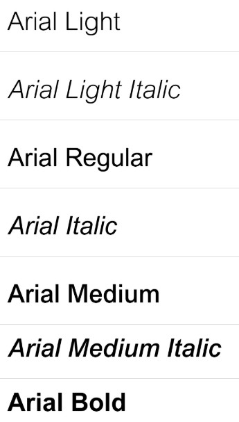
<h2>Imagery</h2>

The images used are all technology themed, including motherboards, pc cases and desktop setups.

<h2>Wireframes</h2>

Wireframes were created for desktop and mobile use using wireframe.cc 

<ul>
  <li>Home Page Pc</li>
  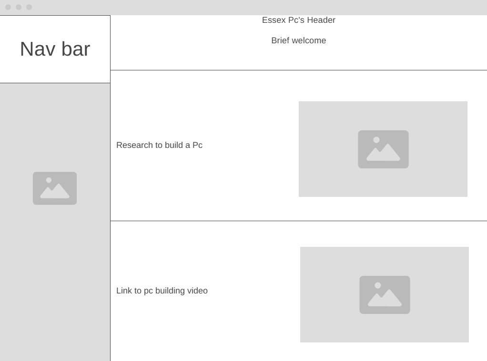
  

  <li>Home Page Mobile</li>
  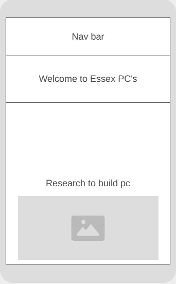
  

  <li>Builds Page</li>
  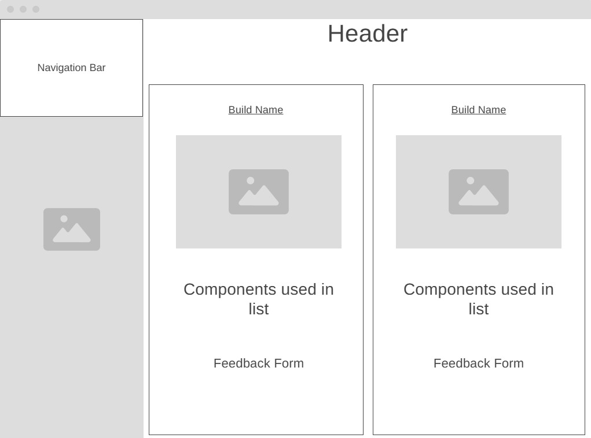
  <li>Builds Mobile</li>
   
  <li>Contact Us Page</li>
    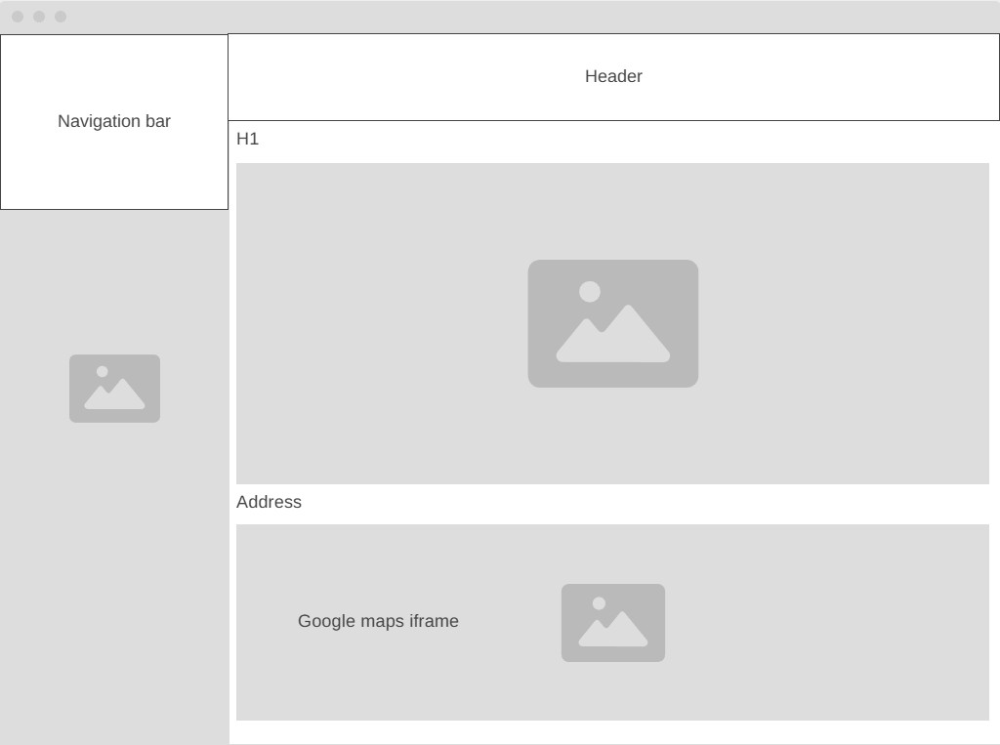
  <li>Contact Us Page Mobile</li> 
   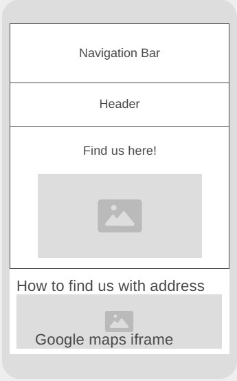
  <li>Feedback Page</li>
   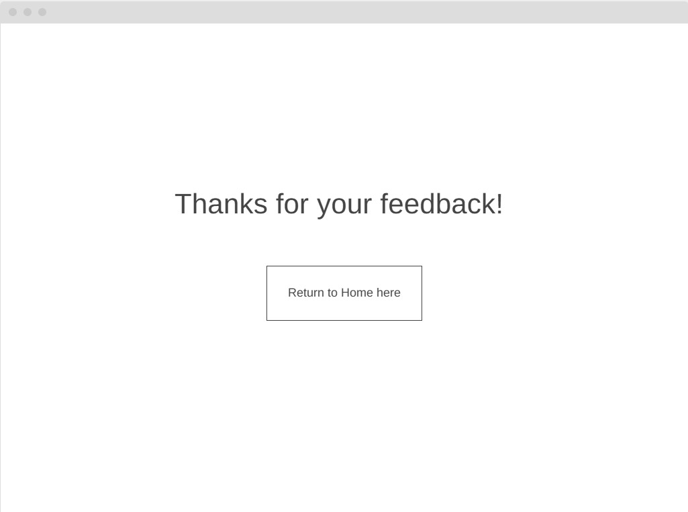
  <li>Feedback Page Mobile</li>
   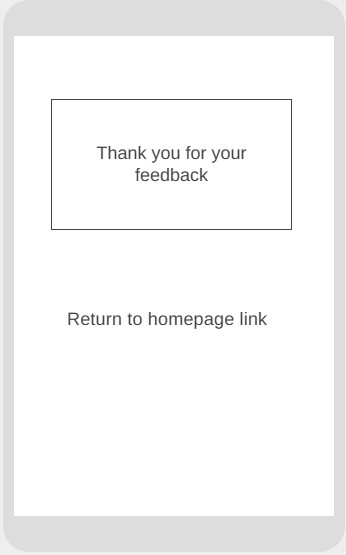
</ul>
<h2>Features</h2>

The website consists of 4 pages, the home page, the builds page, the contact us page and the feedback page. The home page consists of 3 sections giving detailed instruction of what to consider when choosing your new pc parts, the second showcasing a video of how to build your own pc and the last listing common causes of pc faults

<ul>
  <li>All the pages will consist of a navigation bar that aligns to the left side of the screen that scales with the size of the viewers resolution. Once the resolution hits 700px wide the website adjusts moving the navigation bar from the left to the top of the screen using a media query, this improves the users experience. The navigation bar will have a background of a motherboard that contrasts well with the font colour. The navigation bar will include links the Home, Contact us and Builds page.  </li>
</ul>
  <h3>Home Page</h3>
<ul>
  <li>Header with a brief welcome introducing the user to what the website is about.</li>
  <li>Main content divided into readable sections the first being what parts to consider when building your pc the second being a useful video that showcases the steps to build a pc.</li>
</ul>
<h3>Form page</h3>
  <ul>
    <li>This is the page linked to the submit button on the builds page, it displays a thank you message for the feedback given by the user.</li>
    <li>Will contain a link to take you back to the homepage</li>
  </ul>
<h3>Builds</h3>
<ul>
  <li>This page contains individual sections where builds are displayed and the specifications of the build is listed. Each build has a feedback form for the user to fill out on their thoughts of the build, this can be posted using the submit button.</li>
</ul>
<h3>Find us</h3>
 <ul>
   <li>Find us will include a section that showcases where the store is physically located</li>
   <li>The Footer will contain the street address and the google maps iframe</li>
 </ul>
 <h3>Future Implementations</h3>
 <ul>
   <li>Add an online store for easier purchase options using java script</li>
   <li>Add new builds to the build page</li>
   <li>Competitions page showcasing other peoples builds and ideas</li>
 </ul>
 <h3>Accessibility</h3>
 
I have used the following to ensure that my website is accessible and user friendly.

 <ul>
   <li>Used semantic html</li>
   <li>Used alt attributes where needed on images to give a good description of what the image shows</li>
   <li>Used good contrasting colours for the font and background that works well with the images used</li>
 </ul>

<h2>Technologies Used</h2>  
<h3>Language Used</h3> 

HTML, CSS and Java script were used to create this website

<h3>Framework, Libraries, websites and programs used</h3> 
<ul>
  <li>Git was used for version control</li>
  <li>Github was used to save and store my files for the website allowing me to access it anywhere on any device</li>
  <li>Bootstrap 4 CDN was used to help build the navigation bar</li>
  <li>Edge inspect tool to help troubleshoot and test new styles and features of the website without making it permenant</li>
  <li>Wireframes were built in wireframe.cc</li>
  <li>https://tinypng.com/ was used to compress images for better load speed</li>
</ul>
   <h2>Deployment And Local Development</h2>
   <h3>Deployment</h3>
   
Github Pages was used to deploy the live website. The instructions to achieve this are below:
  
<ol>
  <li>Log in (or sign up) to Github.</li>
  <li>Find the repository for this project, Essex-Pc-s.</li>
  <li>Click on the Settings link.</li>
  <li>Click on the Pages link in the left hand side navigation bar.</li>
  <li>In the Source section, choose main from the drop down select branch menu. Select Root from the drop down select folder menu.</li>
  <li>Click Save. Your live Github Pages site is now deployed at the URL shown.</li>
</ol>
<h3>Local Development</h3>
<h4>How to Fork</h4>

To fork the Essex Pc's repository:

<ol>
  <li>Log in (or sign up) to Github.</li>
  <li>Go to the repository for this project, https://github.com/Howlerloud/Essex-Pc-s.</li>
  <li>Click the Fork button in the top right corner.</li>
  </ol>
<h4>How to Clone</h4>

To clone the Essex-Pc-s repository:

<ol>
  <li>Log in (or sign up) to GitHub.</li>
  <li>Go to the repository for this project, https://github.com/Howlerloud/Essex-Pc-s.</li>
  <li>Click on the code button, select whether you would like to clone with HTTPS, SSH or GitHub CLI and copy the link shown.</li>
  <li>Open the terminal in your code editor and change the current working directory to the location you want to use for the cloned directory.</li>
  <li>Type 'git clone' into the terminal and then paste the link you copied in step 3. Press enter.</li>
</ol>
<h2>Testing</h2>

Testing was key throughout the development of the project. I utilised the edge inspect tool multiple times and the chrome developer tool throughout testing to check and assess key issues with the website

The following issues were raised during the projects development

<ul>
  <li>When changing the window size of builds before it hit the 700px media query mark the inline builds would become staggered. Fixed by simply using vertical-align: top; to stop the adjustment when changing screen sizes</li> </li>
  <li>When the website was viewed at lest than 700px width the images would overlap the fixed navigation bar. Fixed using z index to give the navbar priority.</li>
  <li>When building the website capital letters were used for file paths, this caused issues when it was uploaded to github and was corrected to allow compatibility</li>
  <li>During the  initiall planning of the website the chosen background colour was to be white but this was found to be hard on the eyes to viewers and was corrected early on in the development</li>
  <li>Originally my forms used a javascript syntax to inform the user that all form boxes needed to be filler out using a pop up. It worked locally but when uploaded to git it would produce a 405 error. To address this I eventually used a "required" attribute instead.</li>
</ul>
<h4>Testing Links</h4>
<ol>
  <li>All internal links were tested on the index page and worked. All external links opened in a new tab at took you to the correct address.</li>
  <li>All internal links were tested on the find us page worked. All external links opened in a new tab at took you to the correct address.</li>
  <li>All internal links were tested on the builds page worked. All external links opened in a new tab at took you to the correct address.</li>
  <li>All internal links were tested on the form page worked. All external links opened in a new tab at took you to the correct address.</li>
</ol>
<h4>Testing Forms</h4>
<ol>
  <li>Trying to submit the feedback form with no fields filled will prompt the user to fill in the email first.</li>
  <li>Trying to submit the feedback form with just the email filled in will then be prompted to fill in the feedback section</li>
  <li>Once both email and feedback have been filled will the form allowed to be sent</li>
</ol>
<h3>W3C Validator</h3>

The W3C validator was used to validate the HTML on all pages of the website. Jigsaw was used to validate CSS in the style.css file.

 

<a href="https://validator.w3.org/nu/?doc=https%3A%2F%2Fhowlerloud.github.io%2FEssex-Pc-s%2Findex.html">Index page</a>

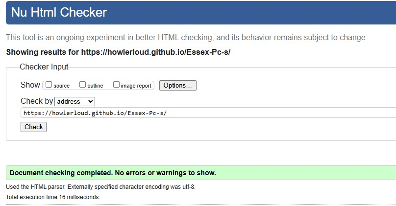

<a href="https://validator.w3.org/nu/?doc=https%3A%2F%2Fhowlerloud.github.io%2FEssex-Pc-s%2Fbuilds.html">Builds Page</a>

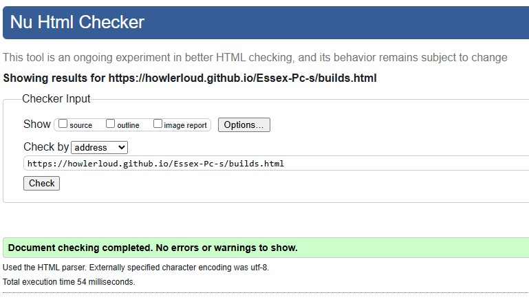

<a href="https://validator.w3.org/nu/?doc=https%3A%2F%2Fhowlerloud.github.io%2FEssex-Pc-s%2Ffind_us.html">Find us here Page</a>

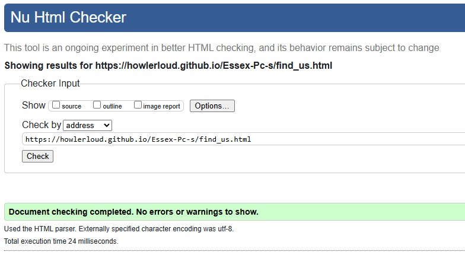

<a href="https://validator.w3.org/nu/?doc=https%3A%2F%2Fhowlerloud.github.io%2FEssex-Pc-s%2Fform.html%3Femail%3Dhowlerjr%2540hotmail.co.uk%26feedback%3D1">Form Page</a>

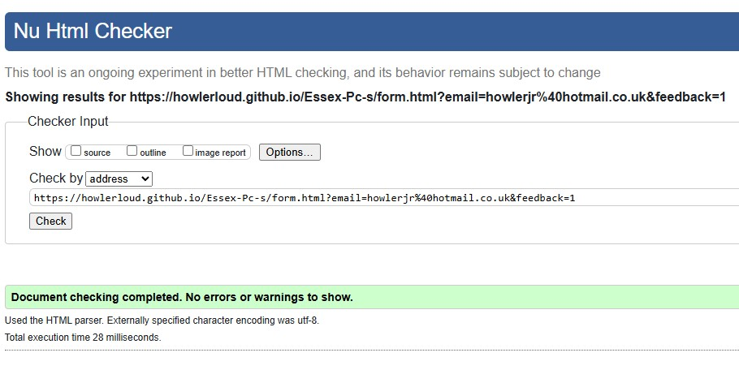

Style sheet

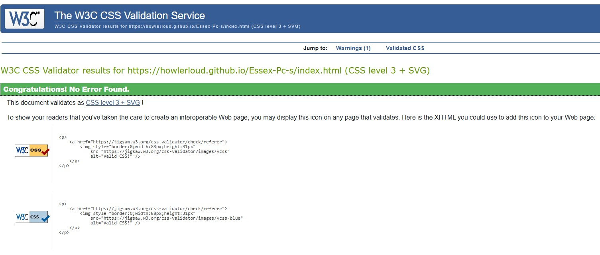
<ul>
  <li></li>
</ul>
<h3>Solved Bugs</h3>
<ol>
  <li>As mentioned before in the builds page when the screen was resized on desktop the containers holding the builds would become mis aligned and start to stagger, this would get worse the smaller the screen size up untill the media query at 700px would fix it. To stop my inline items from staggering I used the vertical-align:top; CSS to fix the issue meaning all my inline blocks would stay at the same level</li>
  <li>When scrolling on mobile the images would overlap the navbar as the navbar had changed positions to the top of the screen instead of being aligned left. This was fixed using the z index CSS to give the narbar priority over all over media files</li>
  <li>Initially the first picture on the index page would slowly overlap the text when resizing the screen. This was fixed by using the justify left CSS and instead of using px to size the image it was changed to view width to allow for resizing</li>
  <li>The Feedback form would post even if there was no content, Java script was added to return a message to the user that all fields needed to be filled in for them to send their feedback</li>
</ol>

 <h3>Testing User Stories</h3>
 <h4>First Times Users</h4>
  <ul>
    <li>Im struggling to figure out what parts are needed to build a pc. The Home page has a detailed list in order of what parts are needed to build your own pc and a link to a compatibility checker.</li>
  </ul>
    
    
  <ul>
    <li>I want to see if the parts I have chosen are a good choice in this market. The builds page contains some great choices for parts in the current market for users to compare their builds too.</li>
  </ul>
      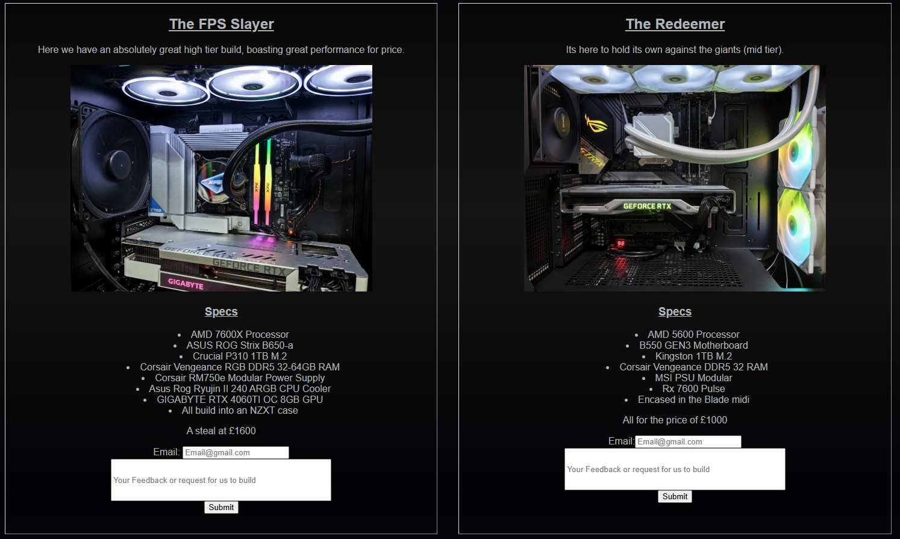
      <ul>
        <li>I want easy to use navigation to find the information I need. The navigation bar is simple and easy to read located in the top left of the screen on desktop and at the top on mobile. It isaccessible on all pages except the form page which contains a link back to the home page.</li>
      </ul>
          
  <h4>Returning Users</h4>
    <ul>
      <li>I want to be able to see what steps are taken when building a pc. We have included a POV video of how to build a pc from start to finish detailing all the steps needed.</li>
    </ul>
    
 <ul>
   <li>I have just built my pc but it wont boot, what should I troubleshoot first? On our home page we have put a lot of the most common issues people have when first building their pc start from the top and work your way down!</li>
 </ul>
 
 <h4>Frequent Users</h4>
 <ul>
   <li>I want to see what parts are a good choice to upgrade my current build. We offer a builds page that lists our personal choices for builds and states what tier we believe they sit at, high, medium and low.</li>
 </ul>
 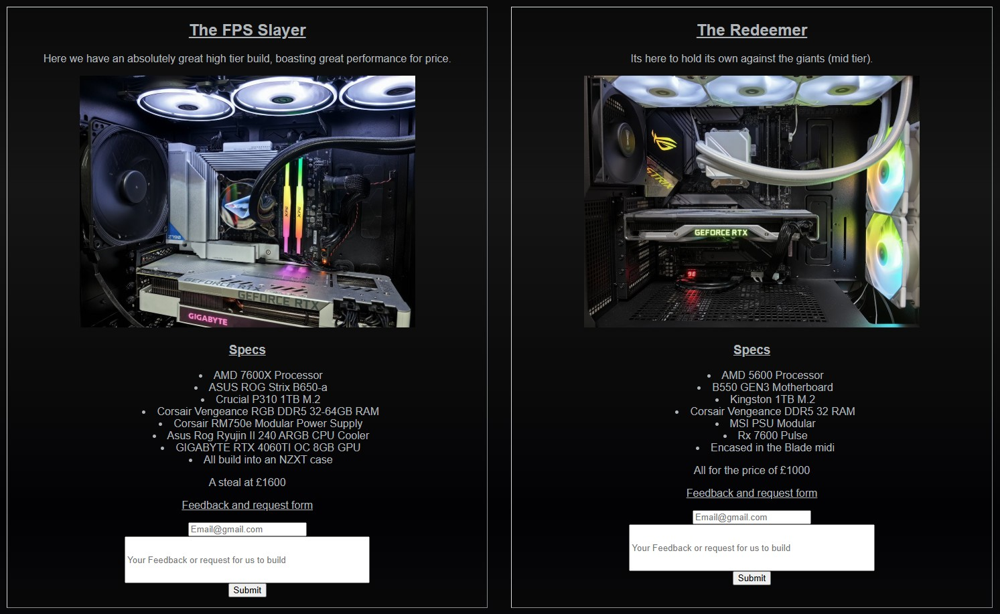
 <ul>
   <li>I want to be able to give my feedback of the builds listed. We have included a form under each build to give your opinion on the build and if you think it can be improved in anyway</li>
 </ul>
 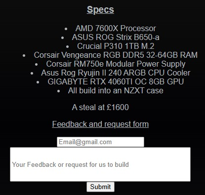
<h3>Performance Testing</h3>
<h2>Lighthouse</h2>

I used lighthouse an inbuilt chrome developer tool that tests the webpage on 4 metrics, performance, accessibility,best practices and SEO

Index page scores desktop

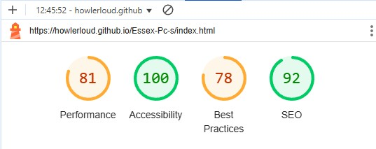
  
Index page scores mobile

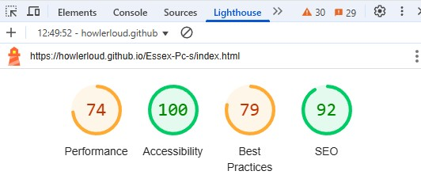

Builds page scores

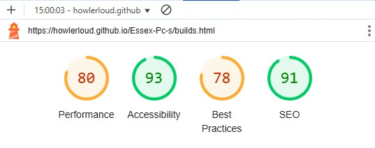
  
Builds page scores mobile

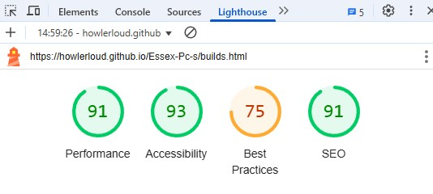

Find us page scores

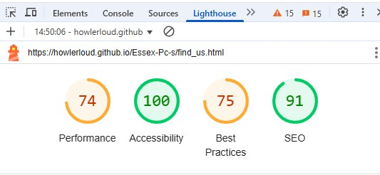
  
find us page scores mobile

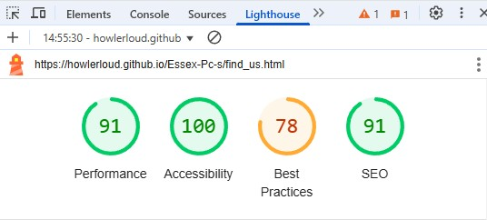

Form page scores

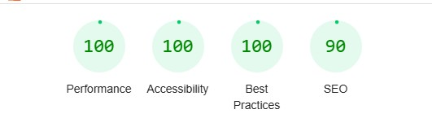
  
form page scores mobile

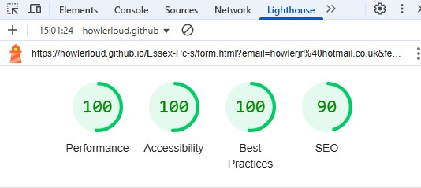

When testing my webpage using lighthouse it highlights the fact my navigation bar takes the longest to load due to the jpg and the size of the bar. To help I used tinypng to compress the image. It instead recommends updating my jpg to the next gen format WebP and AVIF.

 

Lighthouse also suggests preconnecting third party origins like my youtube iframe

<h2>Credits</h2>
<h3>Code Used</h3>
<ul>
  <li><a href="https://blog.shahednasser.com/how-to-style-an-audio-element/">CSS used to help style the audio element</a></li>
</ul>
<h3>Content</h3>
<ul>
  <li>All the content for the website was written by the owner of Essex Pc's</li>
</ul>

All media used for the website was taken from pexels

<ul>
  <li><a href="https://www.pexels.com/@zeleboba/">Andrey Matveev</a></li>
  <li><a href="https://www.pexels.com/@mintworkspace/">Minh Phuc</a></li>
</ul>
